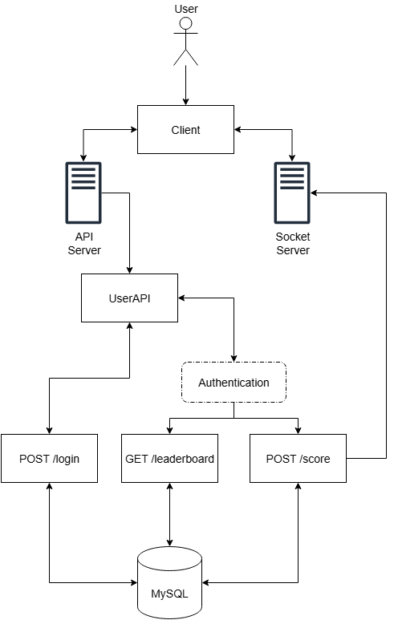

# Scoreboard API Module

This module provides backend API services for a website scoreboard. It manages user authentication, user scores, and supports real-time leaderboard updates.

## Requirements

1. We have a website with a score board, which shows the top 10 user’s scores.
2. We want live update of the score board.
3. User can do an action (which we do not need to care what the action is), completing this action will increase the user’s score.
4. Upon completion the action will dispatch an API call to the application server to update the score.
5. We want to prevent malicious users from increasing scores without authorisation.

## Features

- User registration and login with JWT authentication
- Maintains a scoreboard showing the top 10 users’ scores
- Users can increase their score by performing actions
- Secure API endpoints for updating scores and fetching leaderboard
- Real-time leaderboard updates via WebSocket (Socket.IO)
- Prevents unauthorized or malicious score increases

## Prerequisites

- [Node.js](https://nodejs.org/) (v16 or higher recommended)
- [npm](https://www.npmjs.com/)
- MySQL database

## Technology

1. Server: ExpressJS
2. Database: TypeORM + MySQL
3. Socket: SocketIO

## API Endpoints

### 1. User Login or Register

- **POST** `/api/v1/users/login`
- **Request Body:**
  ```json
  {
    "username": "string"
  }
  ```
- **Response:**
  - `200 OK` with JWT token and user info

### 2. Get Leaderboard

- **GET** `/api/v1/users/leaderboard`
- **Headers:** `Authorization: Bearer <token>`
- **Response:**
  - `200 OK` with top 10 users’ scores

### 3. Update Score

- **POST** `/api/v1/users/score`
- **Headers:** `Authorization: Bearer <token>`
- **Response:**
  - `200 OK` with new score and rank

## Security

- All endpoints (except login/register) require JWT authentication.
- The server verifies that the userId in the token matches the action.
- Rate limiting and idempotency checks are recommended to prevent abuse.

## Real-Time Updates

- The server uses Socket.IO to push leaderboard updates to all connected clients whenever a user’s score changes.
- Clients should listen for the `leaderboard` event to update their UI in real time.

## Application Data Flow Illustration



## Flow of Execution

### Prepare the MySQL Database

Create a MySQL database named **_leaderboard_**:

```sql
CREATE DATABASE leaderboard;
```

### Clone the repository

```sh
git clone https://github.com/duykhang2103/Code-Challenges.git
cd src/problem6
```

### Setup Environment Variables

```bash
cp .env.example .env
```

Then, edit _.env_ and fill in the required variables (e.g., database connection, port, etc.).

### Install Dependencies

```bash
npm install
```

### Database Migration

Generate and apply TypeORM migrations:

```bash
npm run typeorm:generate
npm run typeorm:run
```

### Build and Run Server

```bash
npm run build
npm run start
```

## Implementation Notes

- Use rate limiting middleware to prevent abuse.
- Store action timestamps to detect suspicious patterns.
- Properly handle errors with Global Error Handler Middleware.
- Use a Socket.IO instance to emit events from any service.

## Suggestions for Improvement

- Add monitoring and alerting for suspicious activity.
- Support pagination for larger scoreboards.
- Allow filtering or searching users by name or rank.
- Add tests for authentication and real-time updates.

---
